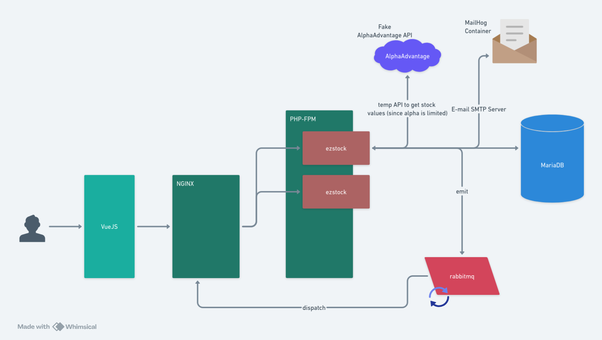

# :dollar: EzStock

*Click over the image to access whimscal*

## Requirements
 - Docker: ~24
 - docker-compose: ~1.29.2

## How to run the project

 - Rename .env.examples variables (one in the root and the other one into ezstock folder)
   - The root .env is related to docker.compose environment
 - `docker-compose up`

## Services

### MailHog
All e-mails are sent to this container. If you want to validate if your e-mail was received, just access the following link: `http://localhost:8025/`

### Rabbimq
You can track all requests and make a traffic analysis, accessing this link: `http://localhost:15672/#/`. The credentials are set in the `.env` file.

### alphavantage
I just created this container because the public api from alphavantage only supports 25 requests, Thus, this service only returns a dumb JSON (doesn't matter if you change the query parameter)

## Utils Container Commands

 - `docker-compose exec php bin/console messenger:consume amqp -vv`
   - Trigger rabbitmq to start processing the queue
 - `docker-compose exec php bin/console doctrine:migrations:diff`
   - This command will analyze the entities, and if there was any change, will generate a migration. Once migration is generated, it's going to show its name (DoctrineMigrations\\Version20240730002030), so you just need to run
 - `docker exec php bin/console doctrine:migrations:execute --up DoctrineMigrations\\Version20240730002030`

## Import postman
You can find all postman files (environments file and collections file) to be imported inside the folder `assets/postman`.

## TODO
 - Create frontend
 - Run rabbitmq automatically, without the need of running the command line on container